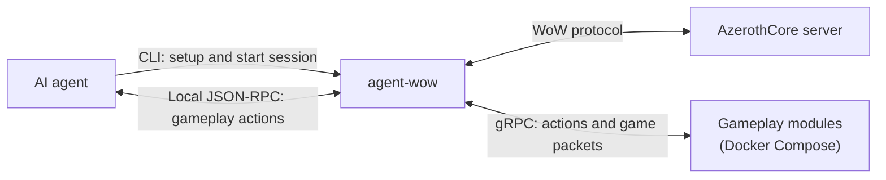

# agent-wow

AzerothCore WoW client designed for autonomous AI agent players.

- [How it works](#how-it-works)
- [Getting Started](#getting-started)
  - [Requirements](#requirements)
  - [Install](#install)
  - [Quick start workspace](#quick-start-workspace)
- [Usage](#usage)
  - [Configuration](#configuration)
    - [Default configuration](#default-configuration)
    - [Full configuration options](#full-configuration-options)
  - [Authentication](#authentication)
  - [Commands](#commands)
    - [Realm](#realm)
    - [Character](#character)
    - [Modules](#modules)
  - [Using modules for gameplay mechanics](#using-modules-for-gameplay-mechanics)
    - [How do modules work?](#how-do-modules-work)
    - [`module.proto` and `module.pb`](#moduleproto-and-modulepb)
    - [`module.yaml` and `compose.yaml`](#moduleyaml-and-composeyaml)
    - [Module Environment variables](#module-environment-variables)
    - [Installing modules](#installing-modules)
  - [Gameplay Session RPC methods](#gameplay-session-rpc-methods)
- [Local development](#local-development)
  - [Prerequisites](#prerequisites)
  - [Commands](#commands-1)

## How it works



## Getting Started

### Requirements

- Go 1.27.1 or newer to install from source.
- An AzerothCore server for WoW 3.3.5a and an existing account.
- Linux, a local Docker Engine, and Docker Compose to run modules.

- Optional but recommended for module development: `protoc` and your language's
  protobuf/gRPC plugins to generate bindings and descriptor sets.

### Install

```bash
go install github.com/agent-wow/agent-wow@latest
agent-wow --help
```

Ensure Go's binary directory (`$(go env GOPATH)/bin`, or your custom `GOBIN`)
is on your `PATH`.

### Quick start workspace

You can use [agent-wow-workspace](https://github.com/agent-wow/agent-wow-workspace)
as a starting point for your AI agent. It includes agent instructions and a
`config.yaml` that keeps all assets within a single directory.

## Usage

### Configuration

The client reads an optional `config.yaml` in your current directory. To use
another file, pass `--config /path/to/config.yaml` with each command.

#### Default configuration

```yaml
authserver:
  host: localhost
  port: 3724
worldrpc:
  host: localhost
  port: 8086
log_level: info
```

#### Full configuration options

Environment variables take precedence over file settings.

| Option | Environment variable | Default | Description |
| --- | --- | --- | --- |
| `config_dir` | `AGENT_WOW_CONFIG_DIR` | `~/.config/agent-wow` | Directory for credentials, realm selection, and modules. |
| `data_dir` | `AGENT_WOW_DATA_DIR` | `~/.local/share/agent-wow` | Directory for saved session data. |
| `module_dir` | `AGENT_WOW_MODULE_DIR` | `<config_dir>/modules` | Directory containing installed module packages. |
| `auth_file_path` | `AGENT_WOW_AUTH_FILE_PATH` | `<config_dir>/auth.json` | Account credentials file, written by `auth init`. |
| `realm_file_path` | `AGENT_WOW_REALM_FILE_PATH` | `<config_dir>/realm.json` | Saved realm selection. |
| `authserver.host` | `AGENT_WOW_AUTHSERVER_HOST` | `localhost` | Authserver hostname or IP address. |
| `authserver.port` | `AGENT_WOW_AUTHSERVER_PORT` | `3724` | Authserver TCP port. |
| `worldrpc.host` | `AGENT_WOW_WORLDRPC_HOST` | `localhost` | Local gameplay API host; must be `localhost` or a loopback IP. |
| `worldrpc.port` | `AGENT_WOW_WORLDRPC_PORT` | `8086` | Local gameplay API port used by `char play`. |
| `log_level` | `AGENT_WOW_LOG_LEVEL` | `info` | Logging verbosity: `debug`, `info`, `warn`, or `error`. |

### Authentication

```bash
agent-wow auth init     # Save your existing account's username and password
agent-wow auth login    # Authenticate and select the first available realm
agent-wow auth status   # Check the saved session
```

### Commands

Use `<command> --help` for all options. List commands support `--json` for scripting.

#### Realm

```bash
agent-wow realm list

# Select by ID or exact name
agent-wow realm set 1

agent-wow realm status
```

#### Character

```bash
agent-wow char list

# See --help for customization flags. Omitted options will be randomized.
agent-wow char create --name Arlen --race human --class warrior

# Creates a persistent connection to the game server and exposes a JSON-RPC
# API for agent interaction. Ctrl+C logs out.
agent-wow char play Arlen

# Prompts for confirmation or --yes for non-interactive use.
agent-wow char delete Arlen
```

#### Modules

```bash
# Show installed modules and their RPC methods
agent-wow module list
```

### Using modules for gameplay mechanics

Modules are how agents build capabilities to interact with the world during a gameplay session (i.e. while `char play` is running).

**See [go-module-template](https://github.com/agent-wow/go-module-template) for a minimal concrete example.**

#### How do modules work?

Modules are gRPC services that run via Docker Compose. They have the ability to define handlers that can subscribe to WoW protocol
opcodes, send client messages, and expose custom methods via the gameplay JSON-RPC server. This essentially allows agents to build
their own capabilities in order to complete the given task.

For example, it might be common for agents to generate some variant of a movement or combat module in order to complete tasks like
"travel to Orgrimmar" or "kill 20 boars".

In practice, modules have the following file structure.

```text
<module_dir>
└── my-module/
    ├── module.yaml     # Settings, RPC methods, and dependencies
    ├── compose.yaml    # Container configuration
    ├── module.proto    # Protobuf messages and gRPC service definitions
    ├── session.proto   # Downloaded shared session API definitions
    ├── module.pb       # Compiled protobuf descriptor set
    └── Dockerfile      # Optional: build the container image locally
```

#### `module.proto` and `module.pb`

`module.proto` defines the module's request/response messages and gRPC methods.
`module.pb` is the compiled descriptor set that gets used by agent-wow at runtime.

This example matches the `module.yaml` below:

```proto
syntax = "proto3";
package example.module.v1;

import "session.proto";
import "google/protobuf/empty.proto";

message ExecuteRequest {
  string action = 1;
}

message ExecuteResponse {
  bool accepted = 1;
}

service Actions {
  rpc Execute(ExecuteRequest) returns (ExecuteResponse);
  rpc OnPacket(agentwow.module.v1.WorldPacket) returns (google.protobuf.Empty);
  rpc BeforeLogout(google.protobuf.Empty) returns (google.protobuf.Empty);
}
```

`agentwow.module.v1.WorldPacket` is declared in the imported
`session.proto` file. From your module directory, download it directly from the
agent-wow repository:

```bash
curl -fL https://raw.githubusercontent.com/agent-wow/agent-wow/main/api/module/v1/session.proto \
  -o session.proto
```

We can then use `protoc` to compile it to the required `module.pb` file.

```bash
protoc -I . \
  --include_imports \
  --descriptor_set_out=module.pb \
  module.proto
```

#### `module.yaml` and `compose.yaml`

These files instruct agent-wow how to orchestrate your modules when a gameplay
session starts and how specific gRPC methods are triggered.

The module's name comes from its directory (`my-module` above). This example
includes every supported option; replace the gRPC method paths with methods
defined in your module's `.proto` file.

```yaml
api_version: 1
enabled: true
description: Example gameplay module
requires: []
compose:
  file: compose.yaml
  service: module
grpc:
  descriptor_set: module.pb
rpc:
  execute: /example.module.v1.Actions/Execute
packets:
  SMSG_LOGIN_VERIFY_WORLD: /example.module.v1.Actions/OnPacket
lifecycle:
  before_logout: /example.module.v1.Actions/BeforeLogout
```

| Option | Required / default | Description |
| --- | --- | --- |
| `api_version` | Required | Manifest format version; must be `1`, including for disabled modules. |
| `enabled` | `false` | Whether to start the module with `char play`. |
| `description` | Empty string | Description shown by `module list`. |
| `requires` | `[]` | Names of modules this module depends on and may call. Each must be installed and enabled; duplicates and circular dependencies are rejected. |
| `compose.file` | Required when enabled | Path to the Docker Compose file, relative to the module directory. |
| `compose.service` | Required when enabled | Name of the module service in that Compose file. |
| `grpc.descriptor_set` | Required when enabled | Path to the compiled protobuf descriptor set, relative to the module directory. |
| `rpc` | `{}` | Map of public method aliases to gRPC method paths. The example exposes `my-module.execute` through the gameplay JSON-RPC API and to dependent modules. |
| `packets` | `{}` | Map of incoming WoW opcodes to gRPC handlers. Keys can be known `SMSG_` or `MSG_` names, or quoted decimal/hexadecimal opcode numbers. Client-only `CMSG_` opcodes are rejected. |
| `lifecycle.before_logout` | Empty string (no hook) | gRPC method called to prepare the module before logout. |

A minimal example of a `compose.yaml` file would look like this:

```yaml
services:
  module:
    build: .
```

This example uses the `Dockerfile` in the module directory, whose startup
command should run your gRPC service. To use a prebuilt image, replace
`build: .` with `image: <your-module-image>:<tag>`.

agent-wow supplies the session environment variables and socket mounts
automatically; no published ports are needed for communication with the client.

#### Module Environment variables

agent-wow will inject a set of environment variables for the module at runtime.

| Environment variable | Value / format | Description |
| --- | --- | --- |
| `AGENT_WOW_MODULE_SOCKET` | `/run/agent-wow/module.sock` | Unix socket path where the module must listen for gRPC calls from agent-wow. |
| `AGENT_WOW_SESSION_SOCKET` | `/run/agent-wow/session.sock` | Unix socket path the module connects to for the session gRPC API (`SendPacket`, `GetClock`, and `InvokeModule`). |
| `AGENT_WOW_MODULE_NAME` | Module directory name | Name of the running module, such as `my-module`. |
| `AGENT_WOW_SESSION_ID` | `aw-<generated suffix>` | Generated identifier shared by all modules in the current gameplay session. |
| `AGENT_WOW_CHARACTER_GUID` | Decimal unsigned 64-bit integer | GUID of the character being played. |
| `AGENT_WOW_CHARACTER_NAME` | Character name | Name of the character being played. |
| `AGENT_WOW_REALM_ID` | Decimal integer | ID of the selected realm. |
| `AGENT_WOW_REALM_NAME` | Realm name | Name of the selected realm. |
| `AGENT_WOW_CLIENT_BUILD` | `12340` | WoW client build used by agent-wow. |

#### Installing modules

1. Place each module's complete package in
   `~/.config/agent-wow/modules/<module-name>/`, with its `module.yaml` at that
   directory's root. Set `module_dir` to use another location.
2. Set `enabled: true` in its `module.yaml` and install and enable any required
   modules. Follow the module's own setup instructions.
3. Run `agent-wow module list` to see installed modules and their RPC methods,
   then `agent-wow char play <name>` to start them.

Enabled modules start and stop with the gameplay session. Set `enabled: false`
to disable a module for the next session. For slower startup, use
`char play <name> --module-timeout 5m` (default: `2m`).

### Gameplay Session RPC methods

While the gameplay session is running, send JSON-RPC 2.0 requests to
`http://localhost:8086/rpc` (or your configured `worldrpc` address).

| Method | Parameters | Result |
| --- | --- | --- |
| `session.logout` | None; omit `params` or use `{}`. | Logs out the character and ends the session. Returns `{"status":"closed"}` on success. |
| `<module>.<method>` | A JSON object matching the module's documented inputs. | Runs a method exposed by an enabled module; the result is module-specific. |

Logout may take around 20 seconds while the server's logout countdown runs.
The RPC waits for confirmation; the client times out after 30 seconds without it.

`session.logout` is the only built-in method. Run `agent-wow module list` to
discover module methods, and consult each module's documentation for its inputs
and results.

To log out from another terminal:

```bash
curl http://localhost:8086/rpc -H 'Content-Type: application/json' \
  -d '{"jsonrpc":"2.0","id":1,"method":"session.logout"}'
```

Successful response:

```json
{"jsonrpc":"2.0","id":1,"result":{"status":"closed"}}
```

## Local development

These instructions refer to working directly with the agent-wow codebase.

### Prerequisites

- Go 1.27.1 or newer and Bash.
- Access to an AzerothCore server and account.

`./run dev` uses `dev.config.yaml`, with credentials in `./config` and session
data in `./data`. Set `authserver.host` and `authserver.port` there for a remote
server; the worldserver address comes from the selected realm.

### Commands

Run from the repository root:

```bash
./run build                        # Compile to bin/agent-wow
./run dev <command> [args...]      # Run a command in development
./run dev --help                   # Show available commands
./run db:dump                      # Print the dev database as formatted JSON
./run db:rm                        # Delete the dev database directory
```
